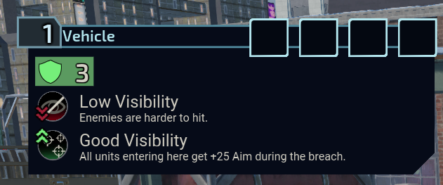

# Project Roswell NCB

-inactive)

This fix implements checks to ensure modifiers which are applied during the breaching phase
don't conflict and make each other redundant (Visibility, etc).

An example of the issues present with-in the base game that this fixes is the below:

### Conflicts & Compatibility

This mod also will not work if downloaded mid-mission as it requires a fresh game state, however it can be safely added, used or removed
at any other point.

### Known Bugs

N/A as of this time.
